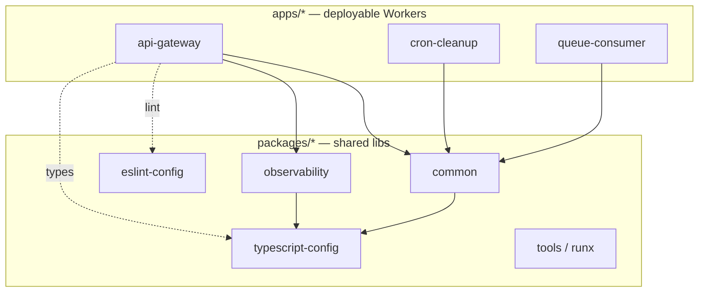
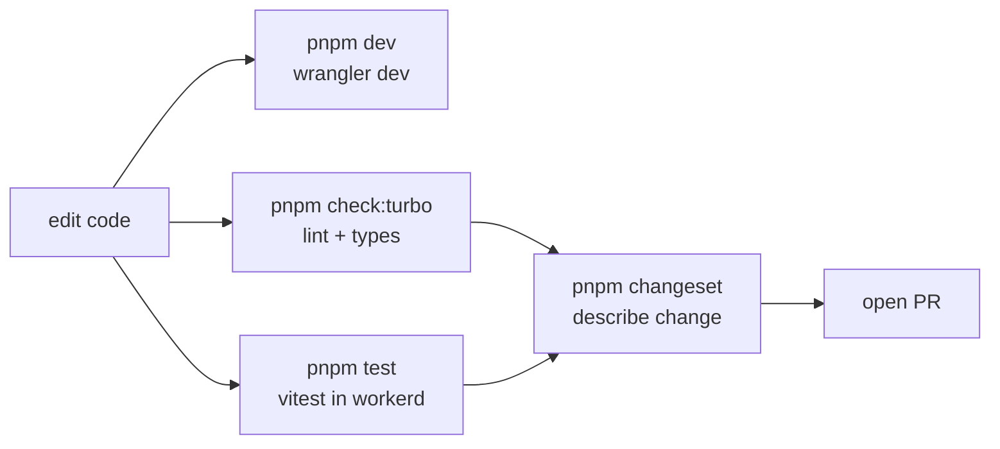
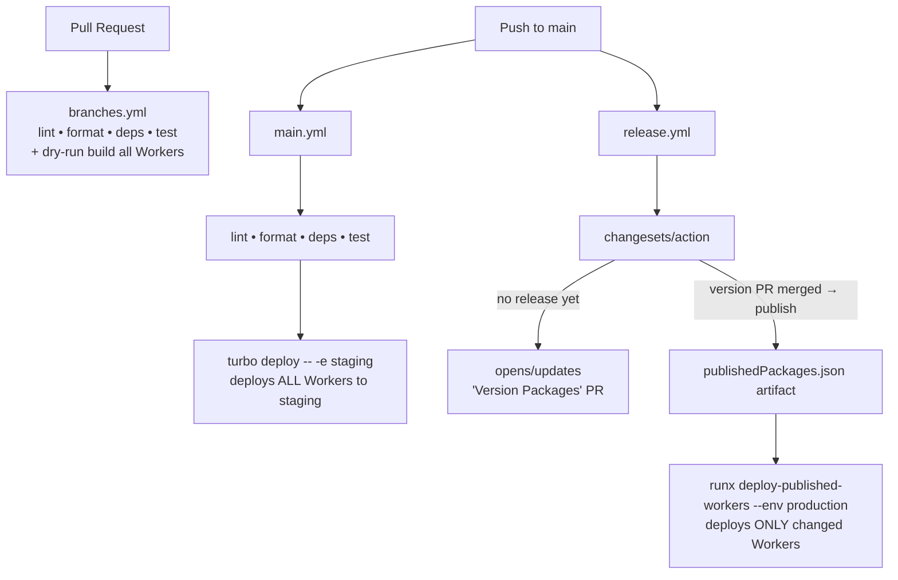

# Cloudflare Workers Monorepo — Architecture Guide

A reference architecture for a general-purpose **Cloudflare Workers monorepo**, derived from the
`cloudflare/mcp-server-cloudflare` repo but generalized so it applies to any collection of Workers
(APIs, cron jobs, queue consumers, static-asset apps, etc.) plus shared internal libraries.

The goal is to let a coding agent **set up, develop, build, test, release, and deploy** without
re-discovering conventions each time.

---

## Table of contents

1. [Stack at a glance](#1-stack-at-a-glance)
2. [Repository layout](#2-repository-layout)
3. [Dependency & task graph](#3-dependency--task-graph)
4. [Configuration layers](#4-configuration-layers)
5. [Anatomy of an app (Worker)](#5-anatomy-of-an-app-worker)
6. [Local development workflow](#6-local-development-workflow)
7. [Testing](#7-testing)
8. [Turborepo task model](#8-turborepo-task-model)
9. [Shared tooling package (`@repo/tools`)](#9-shared-tooling-package-repotools)
10. [Versioning, release & deploy](#10-versioning-release--deploy)
11. [Adding a new Worker (checklist)](#11-adding-a-new-worker-checklist)
12. [Command quick reference](#12-command-quick-reference)
13. [Design principles to preserve](#13-design-principles-to-preserve)

---

## 1. Stack at a glance

| Concern | Tool | Notes |
|---|---|---|
| Package manager | **pnpm** (`pnpm@10.x`, pinned via `packageManager`) | Workspaces, strict, content-addressed store |
| Task runner / caching | **Turborepo** (`turbo`) | Topological task graph + remote/local cache |
| Language | **TypeScript** (pinned, e.g. `5.5.4`) | Shared base tsconfigs |
| Runtime | **Cloudflare Workers** (`workerd`) via **Wrangler** | One Worker per app |
| Web framework (optional) | **Hono** | Common but not required per app |
| Testing | **Vitest** + `@cloudflare/vitest-pool-workers` | Tests run inside `workerd` |
| Linting | **ESLint** (flat-free, v8 classic config) shared package | |
| Formatting | **Prettier** + import-sort plugin | Repo-wide, single config |
| Dependency hygiene | **Syncpack** | Enforces version consistency across workspace |
| Versioning / release | **Changesets** | Per-package semver + changelog |
| Custom automation | **`@repo/tools`** (`runx` CLI + `bin/` scripts) | Repo-specific glue |

---

## 2. Repository layout

```
repo-root/
├── apps/                      # Deployable Workers — one directory per Worker
│   ├── api-gateway/
│   ├── cron-cleanup/
│   └── ...
├── packages/                  # Shared, non-deployed libraries & config
│   ├── common/                #   shared runtime code (@repo/common)
│   ├── observability/         #   metrics/logging helpers
│   ├── eslint-config/         #   @repo/eslint-config
│   ├── typescript-config/     #   @repo/typescript-config (base tsconfigs)
│   └── tools/                 #   @repo/tools  (runx CLI + bin scripts)
├── .changeset/                # Changesets state + config.json
├── .github/
│   ├── actions/setup/         # Composite action: pnpm + node + install
│   └── workflows/             # branches.yml, main.yml, release.yml
├── pnpm-workspace.yaml        # globs: apps/*, packages/*
├── turbo.json                 # task graph
├── vitest.workspace.ts        # aggregates every app/package vitest config
├── tsconfig.json              # root: extends @repo/typescript-config
├── .syncpackrc.cjs            # version-consistency rules
├── .prettierrc.cjs / .eslintrc.cjs
└── package.json               # private root; orchestration scripts only
```

**Key distinction:**
- `apps/*` → **private, deployable** Workers. Each has a `wrangler.jsonc` and a `deploy` script.
- `packages/*` → **private, shared** libraries referenced via `workspace:*`. They are *not* deployed;
  they are bundled into apps at build time.

### Workspace wiring

```yaml
# pnpm-workspace.yaml
packages:
  - 'apps/*'
  - 'packages/*'
```

Internal packages are consumed by name with a workspace protocol so versions always resolve locally:

```jsonc
// apps/api-gateway/package.json
"dependencies": {
  "@repo/common": "workspace:*",
  "@repo/observability": "workspace:*"
}
```

Syncpack enforces that every `@repo/*` dependency is pinned to `workspace:*`
(see `.syncpackrc.cjs` → `versionGroups`), and that all third-party deps are **exact-pinned**
(empty semver range) so the lockfile is the single source of truth.

---

## 3. Dependency & task graph



Turbo uses `package.json` dependencies to derive build order. The `^` prefix in `turbo.json`
(`"dependsOn": ["^check:types"]`) means **"run this task in all dependencies first"**, giving
topological correctness for type-checking, linting, and building.

---

## 4. Configuration layers

### 4.1 TypeScript (`@repo/typescript-config`)

Three base configs are published from the shared package and extended by each project:

| Config | Used by | Highlights |
|---|---|---|
| `tools.json` | root + Node tooling | `module: es2022`, `noEmit`, `declaration` |
| `workers.json` | Worker apps | `moduleResolution: bundler`, includes `worker-configuration.d.ts`, `@cloudflare/workers-types` |
| `workers-lib.json` | shared libs targeting Workers | extends `workers.json`, adds vitest-pool-workers types |

```jsonc
// apps/api-gateway/tsconfig.json
{
  "extends": "@repo/typescript-config/workers.json",
  "include": ["*/**.ts", "./vitest.config.ts", "./types.d.ts"]
}
```

`worker-configuration.d.ts` is **generated** per app by `wrangler types` (see §6) and provides
typed bindings (KV, R2, D1, Durable Objects, env vars).

### 4.2 ESLint (`@repo/eslint-config`)

Single shared `default.cjs` config (TypeScript + import-resolver + unused-imports + turbo plugin).
Every project is a one-liner:

```js
// apps/*/.eslintrc.cjs
module.exports = { root: true, extends: ['@repo/eslint-config/default.cjs'] }
```

`eslint-plugin-only-warn` downgrades everything to warnings locally; CI sets `--max-warnings=0`
(via `GITHUB_ACTIONS` env detection in `run-eslint-workers`) so warnings fail the build.

### 4.3 Prettier & Syncpack

- **Prettier** is repo-wide (`pnpm check:format` / `fix:format`), with sorted imports.
- **Syncpack** (`.syncpackrc.cjs`) pins shared tool versions across the workspace and snaps
  ESLint-v8 plugins together so partial upgrades can't drift. Run `pnpm check:deps` to lint,
  `pnpm fix:deps` to repair.

---

## 5. Anatomy of an app (Worker)

A typical `apps/<name>/` directory:

```
apps/api-gateway/
├── src/
│   ├── api-gateway.app.ts        # Worker entrypoint — `export default { fetch }`
│   ├── api-gateway.context.ts    # `export interface Env { ... }` — typed bindings
│   └── ...                       # routes, handlers, business logic
├── wrangler.jsonc                # Worker config + per-env overrides
├── worker-configuration.d.ts     # GENERATED by `wrangler types`
├── .dev.vars.example             # template for local secrets (copy → .dev.vars)
├── tsconfig.json                 # extends @repo/typescript-config/workers.json
├── vitest.config.ts              # defineWorkersConfig
├── .eslintrc.cjs
└── package.json                  # scripts: dev/start/deploy/test/types/check:*
```

### 5.1 Standard `package.json` scripts (per app)

These names are a **contract** — Turbo and CI rely on them existing across all apps:

```jsonc
"scripts": {
  "dev":         "wrangler dev",          // local runtime (workerd)
  "start":       "wrangler dev",
  "deploy":      "run-wrangler-deploy",   // wrapper from @repo/tools
  "types":       "wrangler types --include-env=false",
  "test":        "vitest run",
  "check:types": "run-tsc",
  "check:lint":  "run-eslint-workers"
}
```

### 5.2 Entrypoint pattern

```ts
// src/api-gateway.context.ts — typed environment/bindings
export interface Env {
  ENVIRONMENT: 'development' | 'staging' | 'production'
  MY_KV: KVNamespace
  MY_DO: DurableObjectNamespace
  SOME_SECRET: string
}

// src/api-gateway.app.ts — Worker entrypoint
import type { Env } from './api-gateway.context'

export default {
  fetch: async (req: Request, env: Env, ctx: ExecutionContext) => {
    // route + handle
    return new Response('ok')
  },
}
```

Durable Object classes (if used) are declared in `src`, `export`-ed from the entrypoint module,
and registered in `wrangler.jsonc` under `durable_objects.bindings` + `migrations`.

### 5.3 `wrangler.jsonc` — multi-environment

The single most important per-app file. It defines the Worker name, entrypoint, compatibility,
bindings, and **per-environment overrides** under `env.staging` / `env.production`:

```jsonc
{
  "$schema": "node_modules/wrangler/config-schema.json",
  "main": "src/api-gateway.app.ts",
  "compatibility_date": "2025-03-10",
  "compatibility_flags": ["nodejs_compat"],
  "name": "api-gateway-dev",

  // base (dev) bindings
  "kv_namespaces": [{ "binding": "MY_KV", "id": "DEV_KV" }],
  "vars": { "ENVIRONMENT": "development" },
  "dev": { "port": 8976 },
  "workers_dev": false,
  "observability": { "enabled": true },

  "env": {
    "staging": {
      "name": "api-gateway-staging",
      "account_id": "<acct>",
      "routes": [{ "pattern": "api-staging.example.com", "custom_domain": true }],
      "kv_namespaces": [{ "binding": "MY_KV", "id": "<staging-kv-id>" }],
      "vars": { "ENVIRONMENT": "staging", "GIT_HASH": "OVERRIDEN_DURING_DEPLOYMENT" }
    },
    "production": {
      "name": "api-gateway-production",
      "account_id": "<acct>",
      "routes": [{ "pattern": "api.example.com", "custom_domain": true }],
      "kv_namespaces": [{ "binding": "MY_KV", "id": "<prod-kv-id>" }],
      "vars": { "ENVIRONMENT": "production" }
    }
  }
}
```

> **Important Wrangler gotcha:** named environments do **not** inherit bindings from the top level.
> Each `env.<name>` must repeat the bindings (KV, DO, Vectorize, AE, etc.) it needs. The repo does
> exactly this — bindings are duplicated per environment intentionally.

---

## 6. Local development workflow

```bash
# 1. One-time: install toolchain-pinned pnpm and deps
corepack enable                 # respects packageManager field
pnpm install                    # --frozen-lockfile in CI

# 2. Per app: generate binding types (writes worker-configuration.d.ts)
cd apps/api-gateway
pnpm types                      # wrangler types --include-env=false

# 3. Provide local secrets
cp .dev.vars.example .dev.vars  # fill in values; .dev.vars is gitignored

# 4. Run the Worker locally in workerd
pnpm dev                        # wrangler dev  (serves on the configured dev.port)
```

Whole-repo checks from the root:

```bash
pnpm check:turbo     # turbo run check  (lint + types across all packages, cached)
pnpm types           # turbo run types  (regenerate wrangler types everywhere)
pnpm check:format    # prettier --check
pnpm check:deps      # syncpack lint
pnpm test            # vitest run --passWithNoTests
```



---

## 7. Testing

- Vitest runs **inside the Workers runtime** via `@cloudflare/vitest-pool-workers`, so bindings,
  Durable Objects, and `workerd` semantics behave like production.
- Each app/package supplies a `vitest.config.ts` (Workers pool) or `vitest.config.node.ts`
  (plain Node, for pure-logic libs). The root `vitest.workspace.ts` globs them all together:

```ts
// vitest.workspace.ts
export default defineWorkspace([
  'apps/*/vitest.config.ts',
  'apps/*/vitest.config.node.ts',
  'packages/*/vitest.config.ts',
  'packages/*/vitest.config.node.ts',
])
```

```ts
// apps/api-gateway/vitest.config.ts
import { defineWorkersConfig } from '@cloudflare/vitest-pool-workers/config'

export default defineWorkersConfig({
  test: {
    poolOptions: {
      workers: {
        wrangler: { configPath: `${__dirname}/wrangler.jsonc` },
        miniflare: { bindings: { /* mock test bindings */ } },
      },
    },
  },
})
```

Run all tests from root with `pnpm test`; per-app with `pnpm test` inside the app. CI uses
`vitest run --silent --testTimeout=15000`.

---

## 8. Turborepo task model

`turbo.json` declares the cross-package task graph. Caching is on for pure checks and off for deploys.

```jsonc
{
  "tasks": {
    "deploy":      { "cache": false, "env": ["CLOUDFLARE_ACCOUNT_ID","CLOUDFLARE_API_TOKEN"], "outputs": ["dist"] },
    "check":       { "dependsOn": ["^check:types","^check:lint","check:types","check:lint"] },
    "check:types": { "dependsOn": ["^check:types"] },
    "check:lint":  { "dependsOn": ["^check:lint"] },
    "types":       { "dependsOn": ["^types"] }
  }
}
```

- `^task` = run `task` in **dependencies first** (topological).
- `deploy` is uncached (always side-effecting) and declares which env vars are part of its inputs.
- Turbo telemetry is disabled via the `run-turbo` wrapper (`DO_NOT_TRACK=1`).

Filtering a single package: `turbo deploy -F api-gateway -- --env staging`.

---

## 9. Shared tooling package (`@repo/tools`)

This package is the repo's automation glue. It exposes two mechanisms:

1. **`bin/` shell scripts** (wired via `"directories": { "bin": "bin" }`) — installed onto `PATH`
   for every workspace package, so app `package.json` scripts can call them by name:

   | Script | Purpose |
   |---|---|
   | `run-wrangler-deploy` | `wrangler deploy` + injects `--var` metadata from `package.json` |
   | `run-tsc` | `tsc --noEmit -p tsconfig.json` |
   | `run-eslint-workers` | eslint w/ cache; `--max-warnings=0` under CI |
   | `run-vitest` / `run-vitest-ci` | pick config, set timeouts |
   | `run-turbo` | turbo wrapper with telemetry off |
   | `run-changeset-new` | stage + create + verify a changeset |
   | `run-fix-deps` | `syncpack fix-mismatches` |

2. **`runx` — a TypeScript CLI** (Commander + zx) for richer automation that's awkward in bash:

   ```ts
   // packages/tools/src/bin/runx.ts
   program.name('runx').addCommand(deployPublishedWorkersCmd)
   ```

   The flagship command, `deploy-published-workers`, reads the Changesets release output and
   deploys **only the Workers that were just published** (see §10).

---

## 10. Versioning, release & deploy

The repo uses **Changesets** for versioning and a **two-track deploy**: every push to `main` goes to
staging; a Changesets "Version Packages" PR merge promotes the changed Workers to production.

### 10.1 Developer flow

```bash
pnpm changeset      # or: pnpm changeset:new  → run-changeset-new
                    # pick affected packages + bump type, write a summary
git add .changeset/*.md && git commit
```

Even though apps are `private`, `.changeset/config.json` sets `privatePackages.version: true` so
private Workers still get versioned and changelogged.

### 10.2 CI pipelines



| Workflow | Trigger | Job |
|---|---|---|
| `branches.yml` | PR → main | Test/check + **dry-run** build of all Workers (`turbo deploy -- -e staging --dry-run`) |
| `main.yml` | push → main | Full checks, then deploy **all** Workers to **staging** |
| `release.yml` | push → main | Changesets action: open/refresh release PR; on publish, deploy **changed** Workers to **production** |

### 10.3 Why two deploy strategies

- **Staging** (`main.yml`): deploy everything on every merge — fast feedback, low risk.
- **Production** (`release.yml`): deploy only what a Changesets release actually bumped. `runx`
  reads the published-package list and runs `turbo deploy -F <pkg> ... -- --env production`. Because
  only Workers have a `deploy` script, non-Worker packages in the list are harmlessly skipped.

### 10.4 The composite setup action

All jobs start with `./.github/actions/setup`:

```yaml
- uses: pnpm/action-setup@v4          # version inferred from packageManager
- uses: actions/setup-node@v4
  with: { node-version: '22', cache: 'pnpm' }
- run: pnpm install --frozen-lockfile --child-concurrency=10
```

### 10.5 Required secrets (GitHub → Actions)

| Secret | Used for |
|---|---|
| `CLOUDFLARE_ACCOUNT_ID` | wrangler deploy target |
| `CLOUDFLARE_API_TOKEN` | wrangler auth (staging + prod) |
| `GITHUB_TOKEN` | Changesets opens the release PR |

Per-app runtime secrets (DB URLs, API keys) are set with `wrangler secret put` (or the dashboard),
**not** committed. `.dev.vars` mirrors them for local dev only.

---

## 11. Adding a new Worker (checklist)

1. `mkdir apps/<name>` and add a `package.json` (`private: true`) with the standard scripts (§5.1).
2. Depend on shared libs via `workspace:*` and shared dev configs (`@repo/eslint-config`,
   `@repo/typescript-config`).
3. Add `tsconfig.json` extending `@repo/typescript-config/workers.json`.
4. Add `.eslintrc.cjs` extending `@repo/eslint-config/default.cjs`.
5. Add `wrangler.jsonc` with `main`, `compatibility_date`, base bindings, and `env.staging` /
   `env.production` blocks (remember: bindings don't inherit — repeat them).
6. Add `vitest.config.ts` (`defineWorkersConfig`) pointing at your `wrangler.jsonc`.
7. Write `src/<name>.context.ts` (`Env` interface) + `src/<name>.app.ts` (`export default { fetch }`).
8. `cp .dev.vars.example .dev.vars`; run `pnpm types` then `pnpm dev`.
9. `pnpm install` at root (registers the new workspace), `pnpm check:turbo`, `pnpm test`.
10. `pnpm changeset` to record the addition. Open a PR — CI dry-run-builds it; merge deploys it to
    staging; a release promotes it to production.

---

## 12. Command quick reference

```bash
# Setup
corepack enable && pnpm install

# Develop one app
cd apps/<name> && pnpm types && cp .dev.vars.example .dev.vars && pnpm dev

# Repo-wide quality gates (what CI runs)
pnpm check:deps      # syncpack
pnpm check:turbo     # lint + types (cached, topological)
pnpm check:format    # prettier
pnpm test            # vitest in workerd

# Fixers
pnpm fix:format
pnpm fix:deps
pnpm update-deps     # syncpack update

# Release
pnpm changeset       # author a changeset

# Deploy (normally CI-driven)
cd apps/<name> && pnpm deploy -- -e staging          # single app
pnpm turbo deploy -- -e staging                       # all apps
pnpm runx deploy-published-workers --env production   # only released apps
```

---

## 13. Design principles to preserve

- **Convention over configuration:** every app exposes the same script names; tooling assumes them.
- **Single source of truth for versions:** exact-pinned deps + Syncpack + frozen lockfile.
- **Shared config as packages:** tsconfig/eslint/tools live in `packages/*` and are imported, never copied.
- **Typed bindings end-to-end:** `wrangler types` → `worker-configuration.d.ts` → `Env` interface.
- **Two-stage promotion:** deploy-all to staging on merge; deploy-only-changed to production on release.
- **Tests in the real runtime:** Vitest Workers pool over mocked Node environments.
